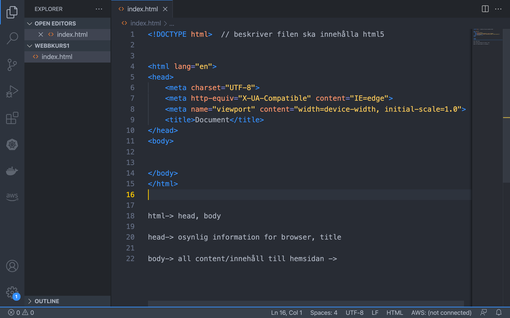

 <h1>  Rubrik 1     </h1>
 
 
   Lorem ipsum dolor sit amet consectetur adipisicing elit. 
     <!--  Necessitatibus suscipit doloremque aperiam
      similique quasi dicta incidunt fugiat fuga ullam ducimus!  
     -->
 

 
Lorem ipsum dolor sit amet consectetur adipisicing elit. Rem dolor pariatur numquam repellendus doloremque 
     doloribus molestias voluptates consequuntur
      aliquam fugit.

 

 paragraf 3 Lorem ipsum dolor sit amet.

Written by Rakib 
 <h2>inline element  ingen radbrytning  </h2>
 Written by Rakib 

Det finns 4 vanliga typer av css positionering: 
static -default 
fixed    - man behöver left, right, top, bottom properties/egenskaper . Den placeras i en bestämd plats i Viewport/skärmen. Även om man scrollar ner eller upp element ska visas på samma position. 
relative     - man behöver left, right, top, bottom properties/egenskaper. Den placeras till en plats beroende på left right top bottom relative till dennes original plats.
absolute    - man behöver left, right, top, bottom properties/egenskaper. Följer relative till sin parent element och parent element måste vara relative.

Läs : 

https://css-tricks.com/absolute-relative-fixed-positioining-how-do-they-differ/

OBS:
 relative positionering kommer att ta sin plats även om det flyttas från sin original plats men  absolute kommer att flyttas helt.
Absolute fungerar inte med static parent

 
 
 
 
<input type="text">

tagnamn : p {}

class namn: .classnamn { }

id :   #uniknamn

#uniknamn{
    color:red;
}

p {
    border: 12px solid green;
}

.border-class{
    border: 2px solid green;
}

* Nollställning:  nollställar browser egna egenskaper. 

* Boxmodell 
 

* Position:- 

relative:- top, right, left , bottom 

absolute:- lämnar sin gammalplats, parent element måste vara relative 

* Flex:- https://wpbeaches.com/flexbox-some-notes-on-container-and-child-item-properties-and-values/
